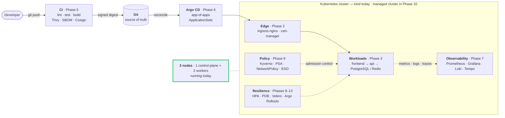

<div align="center">

# kubernetes-platform

**A production-style internal developer platform on Kubernetes.**
GitOps delivery · policy enforced at admission · tested backups · verified resilience.

[](https://sameeralam3127.github.io/kubernetes-platform/)
[](ROADMAP.md)
[](infra/kind/cluster.yaml)
[](docs/decisions/0001-local-cluster-kind-over-k3d.md)
[](LICENSE)

[**Live documentation**](https://sameeralam3127.github.io/kubernetes-platform/) ·
[Roadmap](ROADMAP.md) ·
[Decisions](docs/decisions/) ·
[Local development](docs/local-development.md) ·
[Contributing](CONTRIBUTING.md)

</div>

---

> [!NOTE]
> **Phase 1 of 15 — Foundation.** The repository scaffold, governance, and a
> one-command local cluster work today and are verified end to end. Everything else is
> documented scaffolding with acceptance criteria written in advance.
> Nothing here is described as done before it is — see [ROADMAP.md](ROADMAP.md).

## Contents

- [Why this exists](#why-this-exists)
- [Architecture](#architecture)
- [Quick start](#quick-start)
- [Tech stack](#tech-stack)
- [Roadmap](#roadmap)
- [Platform capabilities](#platform-capabilities)
- [Repository layout](#repository-layout)
- [Design decisions](#design-decisions)
- [Testing](#testing)
- [Contributing](#contributing)

## Why this exists

Most Kubernetes portfolio repositories are a Deployment, a Service, and an Ingress
under a README that claims "production-ready". This one aims at the other thing: the
platform a team would actually run — where deploys go through Git, bad releases stop
themselves, secrets never touch the repository, backups get restored on a schedule,
and resilience claims are tested by breaking things on purpose.

**The problem.** An application team should ship a service without knowing how
ingress, TLS, autoscaling, network policy, secret management, or tracing work. A
platform team should be able to guarantee that every service that ships has all of
them, correctly, by default.

**The approach.** A paved road with guardrails that *reject* unsafe configuration at
admission rather than catching it in review. Missing resource limits, unsigned
images, and `:latest` tags are refused by the cluster, not by a reviewer having a
good day.

It is built as a **cumulative 15-phase roadmap**. Each phase leaves the repository in
a coherent, demoable state and builds on the last rather than bolting on beside it.

## Architecture

The full target architecture. Green is running today; everything else carries the
phase that delivers it.



**Deliberately excluded:** service mesh, multi-cloud, multi-cluster — each with a
written reason in [ROADMAP.md](ROADMAP.md#deliberate-exclusions). What you leave out
is a design decision too.

## Quick start

**Prerequisites** — Docker (or OrbStack / Colima / Podman) with 4 GiB+ memory,
[kind](https://kind.sigs.k8s.io/) 0.20+, `kubectl` within ±1 minor of the cluster,
and `make`. `make preflight` checks all of it and names anything missing.

```bash
git clone https://github.com/sameeralam3127/kubernetes-platform.git
cd kubernetes-platform

make preflight   # verify your toolchain
make up          # create the cluster (1–3 min first run)
make status      # confirm healthy
make down        # tear it all down
```

<details>
<summary><b>Expected output</b></summary>

```console
$ make up
Preflight — kubernetes-platform
 ok  docker 29.6.1 (daemon reachable)
 ok  kind v0.32.0
 ok  kubectl v1.36.1
==> creating cluster 'kubernetes-platform' — this takes 1–3 minutes on first run
 ok  all nodes Ready
 ok  CoreDNS available

NAME                                STATUS   ROLES           AGE   VERSION
kubernetes-platform-control-plane   Ready    control-plane   41s   v1.36.1
kubernetes-platform-worker          Ready    <none>          27s   v1.36.1
kubernetes-platform-worker2         Ready    <none>          27s   v1.36.1

 ok  cluster 'kubernetes-platform' is healthy
```

</details>

`make up` is idempotent and refuses to report success on a half-built cluster —
it probes the API server rather than trusting that the cluster is merely *listed*.
Teardown is scoped by kind cluster **name**, so it is structurally incapable of
touching a real cluster.

Run `make help` for every target. Full walkthrough, configuration, and
troubleshooting: [docs/local-development.md](docs/local-development.md).

## Tech stack

Every component has to justify its operational complexity, not just its popularity.

| Layer | Choice | Status |
| --- | --- | :-- |
| **Local cluster** | [kind](docs/decisions/0001-local-cluster-kind-over-k3d.md) — 1 control-plane + 2 workers | ✅ Phase 1 |
| **Networking** | ingress-nginx, cert-manager | Phase 2 |
| **Packaging** | Helm (reuse) + Kustomize (environments), [each for its strength](helm/README.md) | Phase 4 |
| **CI/CD** | GitHub Actions, Trivy, Syft, Cosign | Phase 5 |
| **GitOps** | Argo CD + ApplicationSets | Phase 6 |
| **Metrics** | Prometheus, Grafana, Alertmanager | Phase 7 |
| **Logs** | Loki + Fluent Bit | Phase 7 |
| **Traces** | OpenTelemetry Collector + Tempo | Phase 7 |
| **Policy** | Kyverno, Pod Security Admission, NetworkPolicies | Phase 8 |
| **Secrets** | External Secrets Operator | Phase 8 |
| **Cloud infra** | Terraform — [provider deferred](docs/decisions/0002-defer-cloud-provider-choice.md) | Phase 10 |
| **Backup / DR** | Velero + independent `pg_dump` | Phase 11 |
| **Chaos** | Chaos Mesh or Litmus | Phase 12 |
| **Progressive delivery** | Argo Rollouts | Phase 13 |

## Roadmap

Fifteen cumulative phases, each independently demoable. Full detail with per-phase
deliverables and acceptance criteria in **[ROADMAP.md](ROADMAP.md)**.

| # | Phase | Status | # | Phase | Status |
| :-: | --- | :-: | :-: | --- | :-: |
| 1 | Foundation | 🟡 | 9 | Scaling & resilience | ⬜ |
| 2 | Cluster basics | ⬜ | 10 | Infrastructure as Code | ⬜ |
| 3 | Application deployment | ⬜ | 11 | Backups & DR | ⬜ |
| 4 | Packaging & overlays | ⬜ | 12 | Chaos engineering | ⬜ |
| 5 | CI/CD | ⬜ | 13 | Progressive delivery | ⬜ |
| 6 | GitOps | ⬜ | 14 | Production readiness | ⬜ |
| 7 | Observability | ⬜ | 15 | Portfolio polish | ⬜ |
| 8 | Security hardening | ⬜ | | | |

🟡 In progress · ⬜ Not started

## Platform capabilities

What each capability will look like when its phase lands. Expand for detail.

<details>
<summary><b>Deployment &amp; environments</b> — Phases 3, 4, 6</summary>

Applications are deployed by hand in Phase 3, packaged in Phase 4, and from Phase 6
onward nothing reaches a cluster except by merging to `main` and letting Argo CD
reconcile.

Three environments — `dev`, `staging`, `prod` — as Kustomize overlays over a single
base. Overlays may differ in replica counts, resources, hostnames, image tags, HPA
bounds, and log level. They may **not** differ in resource *shape*, because an
environment running an untested topology is not a meaningful gate.

See [kustomize/README.md](kustomize/README.md) and [argocd/README.md](argocd/README.md).

</details>

<details>
<summary><b>Observability</b> — Phase 7</summary>

Metrics, logs, and traces joined by consistent labels, so that "spike on a graph →
the logs behind it → the trace of one slow request" is a three-click path rather than
three separate tools.

Alerts are symptom-based rather than cause-based — high CPU that harms nobody is not
an incident — and every alert carries a `runbook_url` pointing into
[runbooks/](runbooks/).

See [monitoring/](monitoring/), [logging/](logging/), [tracing/](tracing/).

</details>

<details>
<summary><b>Security model</b> — Phase 8</summary>

Defence in depth: Pod Security Admission, Kyverno policy-as-code, default-deny
ingress **and** egress NetworkPolicies, External Secrets Operator instead of
committed `Secret` objects, and Cosign signature verification enforced at admission —
signing without verification is theatre.

Every policy ships in Audit mode first. Enforcing on day one breaks deploys and gets
policy switched off entirely, which is the worst outcome.

See [security/README.md](security/README.md).

</details>

<details>
<summary><b>Scaling, backups &amp; disaster recovery</b> — Phases 9, 11</summary>

HPAs tuned on real load-test data rather than guessed thresholds,
PodDisruptionBudgets, and topology spread across both workers. The two-worker local
topology exists precisely so these are testable.

Velero plus independent `pg_dump` backups, with **measured** RTO/RPO and restore
drills that actually run. An untested backup is not a backup.

See [backup/README.md](backup/README.md) and [infra/kind/README.md](infra/kind/README.md).

</details>

> [!WARNING]
> **Until Phase 8 lands, this cluster is not hardened.** The local cluster binds to
> `127.0.0.1` and is for development only. See [SECURITY.md](SECURITY.md).

## Repository layout

Every directory has a README explaining what belongs in it, what does not, and which
phase fills it — so an empty folder is a documented plan, not an unfinished thought.

```
kubernetes-platform/
├── apps/               sample services that exercise the platform
├── argocd/             Application, ApplicationSet, AppProject manifests
├── backup/             Velero schedules, restore drills
├── chaos/              experiments, steady-state hypotheses, results
├── diagrams/           diagram sources + exports
├── docs/               architecture, guides, decision records      ← works today
├── examples/           small workloads proving one capability each
├── helm/               first-party charts
├── infra/kind/         local cluster topology                      ← works today
├── infra/terraform/    cloud infrastructure — provider deferred
├── k8s/base/           raw manifests / Kustomize base
├── kustomize/          dev / staging / prod overlays
├── logging/            Loki, Fluent Bit
├── monitoring/         Prometheus, Grafana, Alertmanager
├── runbooks/           one per failure scenario
├── scripts/            bootstrap, teardown, drills                 ← works today
├── security/           Kyverno, NetworkPolicies, PSA
├── tests/              manifest, policy, integration, smoke
└── tracing/            OpenTelemetry, Tempo
```

## Design decisions

Non-obvious choices are recorded as ADRs in [docs/decisions/](docs/decisions/), each
stating what the choice **costs**, not only what it buys — a decision record that
only lists benefits is marketing.

| ADR | Decision | The tradeoff |
| --- | --- | --- |
| [0001](docs/decisions/0001-local-cluster-kind-over-k3d.md) | kind over k3d for the local cluster | ~3× slower to start and ~3 GB more RAM; `LoadBalancer` never resolves |
| [0002](docs/decisions/0002-defer-cloud-provider-choice.md) | Defer the cloud provider to Phase 10 | `infra/terraform/` reads as empty for nine phases |

## Testing

| Layer | What | Phase |
| --- | --- | :-: |
| Static validation | kubeconform, helm lint, kustomize build | 4 |
| Policy tests | must-block **and** must-allow fixtures per policy | 8 |
| Integration | against an ephemeral kind cluster in CI | 5 |
| Smoke | post-deploy, gates rollback | 6 |
| Resilience | chaos experiments | 12 |

Available today: `make lint-shell` and `make verify` (clean bootstrap → healthy →
teardown). See [tests/README.md](tests/README.md).

## Future work

Beyond the fifteen phases: a real second cluster, PR preview environments,
cost-aware autoscaling, and a policy-driven service catalogue. Tracked as stretch
goals rather than promises.

## Contributing

See [CONTRIBUTING.md](CONTRIBUTING.md). The bar is "would this survive a real
platform team's code review" — every added component has to justify its operational
complexity, and design decisions get recorded as ADRs.

Security issues: **do not** open a public issue. Follow [SECURITY.md](SECURITY.md).

## License

[MIT](LICENSE) © 2026 Sameer Alam
