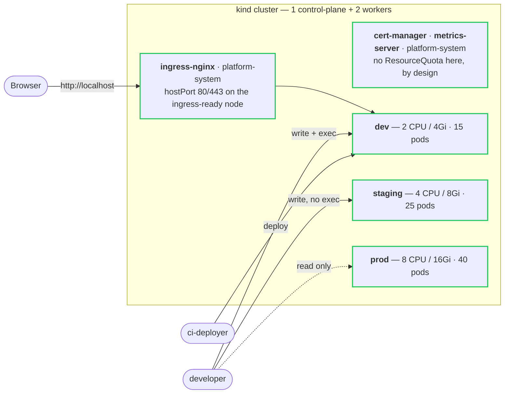

# Architecture

How the platform is put together, and why each piece is shaped the way it is.
This document tracks what **exists**; the plan for what does not is
[ROADMAP.md](../ROADMAP.md).

**Current state: Phase 2 — Cluster basics.**

## Overview



## Layers

### Cluster

One control-plane node and two workers
([infra/kind/cluster.yaml](../infra/kind/cluster.yaml)). Two workers rather than
one is not decoration: pod anti-affinity, `topologySpreadConstraints`,
PodDisruptionBudgets, and the Phase 12 node-drain experiment are all no-ops on a
single node. [`examples/hello-workload/`](../examples/hello-workload/)
demonstrably lands its two replicas on different workers.

Why kind rather than k3d or minikube:
[ADR-0001](decisions/0001-local-cluster-kind-over-k3d.md).

### Namespaces

Four namespaces, organised **per environment** rather than per team.

| Namespace | Purpose | Quota |
| --- | --- | --- |
| `platform-system` | Platform components: ingress, TLS, metrics. Also holds the persona identities. | **None**, by design |
| `dev` | Development workloads | 2 CPU / 4 Gi, 15 pods |
| `staging` | Pre-production gate | 4 CPU / 8 Gi, 25 pods |
| `prod` | Production workloads | 8 CPU / 16 Gi, 40 pods |

Per-environment maps 1:1 onto the Kustomize overlays arriving in Phase 4, which
keeps the overlay model simple. Per-team-per-environment (`checkout-dev`,
`search-prod`, …) would demonstrate multi-tenancy more forcefully at roughly
three times the manifests and a matrix ApplicationSet in Phase 6 — a trade worth
making for a real platform with real teams, not for this one.

**`platform-system` has no ResourceQuota on purpose.** If platform components
were subject to a tenant quota, a namespace full of runaway pods could prevent
the ingress controller from scheduling — a tenant taking down the platform's
control path. The verifier asserts this stays true.

### Capacity governance

Each workload namespace has a `ResourceQuota` (namespace ceiling) and a
`LimitRange` (per-container defaults and bounds). They do different jobs and are
both required:

- **ResourceQuota** caps the namespace in aggregate — compute and object counts.
  Object counts matter more than people expect: runaway controllers create
  objects, and etcd is the shared resource that suffers.
- **LimitRange** supplies `defaultRequest`/`default` to containers that declare
  no resources. Without it, a quota on `requests.*` rejects every unannotated
  pod with a message that does not explain itself. It also enforces `max` (one
  container cannot claim the whole namespace) and `maxLimitRequestRatio` (a
  container requesting 10m with a 2 CPU limit schedules anywhere then starves
  its neighbours).

`prod` deliberately carries a tighter `maxLimitRequestRatio` than `dev`:
over-commitment is tolerable where the blast radius is an afternoon, and is how
a noisy neighbour takes out a node in production.

The dev quota is sized so rejection is **demonstrable** —
[`examples/quota-limits/`](../examples/quota-limits/) reproduces both a
LimitRange refusal and a quota exhaustion in about ten seconds.

### Identity and access

Two personas, defined in [k8s/base/rbac/](../k8s/base/rbac/).

**One ServiceAccount per persona, bound into several namespaces with different
Roles** — not one account per namespace. Three `developer` accounts in three
namespaces would be three unrelated identities that share a name, and "the
developer writes to dev but only reads prod" would not be a true statement about
anybody.

| | dev | staging | prod |
| --- | --- | --- | --- |
| `developer` | write + `exec` | write, no `exec` | **read only** |
| `ci-deployer` | deploy only | — | — |

Plus one cluster-scoped grant: `platform-viewer`, read-only, bound to
`developer`. **Cluster-wide visibility, namespace-scoped authority** is the
split the whole model rests on — during an incident, "is this one app or is the
node unhealthy?" must be answerable without escalating.

`platform-viewer` deliberately does not reuse Kubernetes' built-in `view`
ClusterRole, because `view` grants read on Secrets in every namespace it is
bound to.

Closed by design, and asserted by the verifier:

- No persona can edit RBAC. A role that can edit roles is `cluster-admin` with
  extra steps.
- No persona can raise its own quota. A guardrail you can lift yourself is not
  a guardrail.
- Nothing in the repository binds `cluster-admin`, `edit`, or `admin`.
- `exec` is dev-only and lives in its own Role, so the privilege is visible in
  `kubectl get roles` rather than buried in a rule list.
- Production is read-only for humans. From Phase 6 prod changes arrive through
  Git and Argo CD; a human write path bypasses the audit trail rather than
  adding to it.

ServiceAccounts stand in for real identity because a kind cluster has no OIDC
provider. In Phase 10 the subjects become OIDC groups — the Roles and bindings
do not change.

### Networking

**ingress-nginx** with `hostPort` on the node labelled `ingress-ready=true`
(the control plane), paired with the `extraPortMappings` in the kind config, so
`http://localhost` reaches the cluster. A `Service` of type `LoadBalancer` would
sit `Pending` forever — kind has no cloud controller.

Chosen deliberately rather than inherited: it is one of the reasons this
platform uses kind over k3s, which ships Traefik by default
([ADR-0001](decisions/0001-local-cluster-kind-over-k3d.md)).

**cert-manager** with two ClusterIssuers
([k8s/addons/clusterissuer-selfsigned.yaml](../k8s/addons/clusterissuer-selfsigned.yaml)):

- `selfsigned` — bootstraps the chain
- `platform-ca` — a local CA so issued certificates share a trust root, which is
  what an internal PKI actually looks like

Browsers will warn, and that is fine: what is being demonstrated is the
*lifecycle* — a Certificate resource, a Secret populated by cert-manager,
automatic renewal 30 days before expiry, and an alert when renewal fails
(Phase 7). None of that needs a public CA.

**metrics-server** for `kubectl top` and, from Phase 9, HPA decisions.

## Known local/cloud divergences

Tracked explicitly, because pretending a laptop is production is how people get
surprised in Phase 10.

| Divergence | Why | Resolved in |
| --- | --- | --- |
| `metrics-server --kubelet-insecure-tls` | kind's kubelet serving certs are self-signed and not in the cluster CA. On a managed cluster this flag is a real downgrade — it lets anything impersonating a kubelet feed false metrics to the HPA. | Phase 10 |
| ingress via `hostPort`, not `LoadBalancer` | No cloud controller in kind. | Phase 10 |
| Self-signed CA rather than ACME | No public DNS name to validate against. | Phase 10 |
| `local-path` storage, no CSI snapshots | Constrains what Phase 11 restore drills can prove locally. | Phase 10 |
| Control plane not tainted away from workloads | Reserving one of three nodes wastes a third of a laptop. | Phase 10 |
| NetworkPolicy enforcement unverified | Depends on the CNI; a silently-ignored policy is worse than none because it produces false confidence. | **Phase 8 must verify before claiming segmentation** |

## What is deliberately absent

- **Pod Security Admission labels.** Namespaces carry ownership labels but no
  PSA profile yet. Phase 8 adds them once there are real workloads to test a
  `restricted` profile against — labelling now would mean either a profile
  nothing has exercised, or enforcement that breaks Phase 3 on arrival.
- **NetworkPolicies.** Same phase, same reason. Note the dev/staging/prod
  namespaces currently have **no network isolation between them**.
- **Any application.** Phase 3. `hello-workload` is an example, not a service.

## Bootstrap order

```
make up          →  kind cluster, 3 nodes
make apply-base  →  namespaces → quotas/limits → RBAC   (k8s/base)
make addons      →  ingress-nginx, metrics-server, cert-manager
```

or `make bootstrap` for all three.

Order matters on first apply: namespaces must exist before the quotas and
bindings inside them, and before the addons that install into `platform-system`.
Kustomize sorts `Namespace` first, so `kubectl apply -k` handles it; from Phase 6
the same ordering becomes explicit Argo CD sync waves.

`make verify-platform` asserts all of the above — 40 checks that try to do things
which should be refused, and fail if they are permitted.

## Related

- [ADR-0001](decisions/0001-local-cluster-kind-over-k3d.md) — kind over k3d
- [ADR-0002](decisions/0002-defer-cloud-provider-choice.md) — deferring the cloud provider
- [infra/kind/README.md](../infra/kind/README.md) — cluster topology and limitations
- [k8s/README.md](../k8s/README.md) — manifest conventions
- [examples/](../examples/) — each capability, demonstrated
